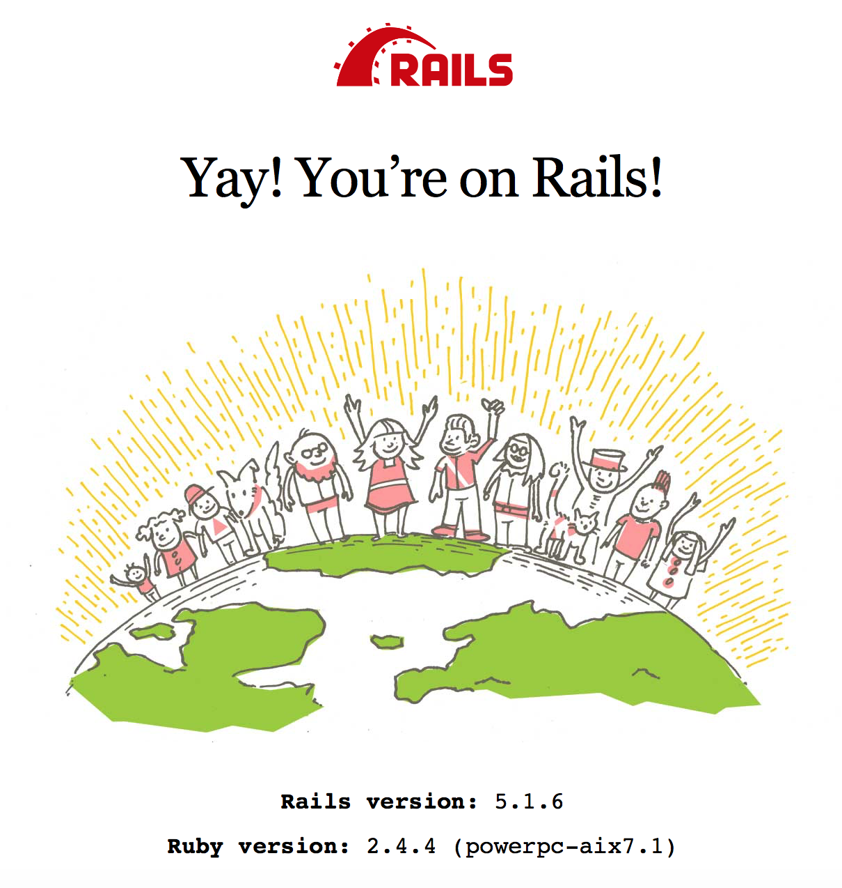
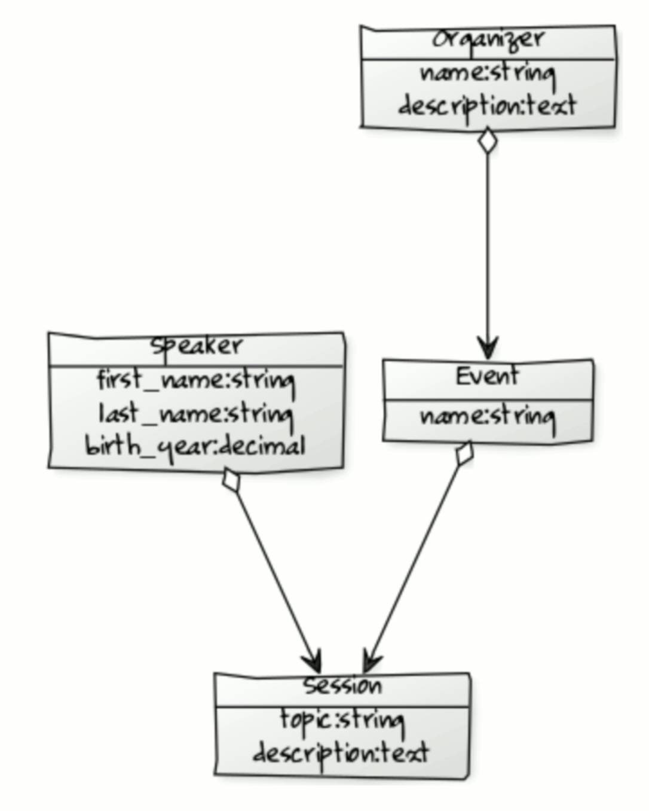
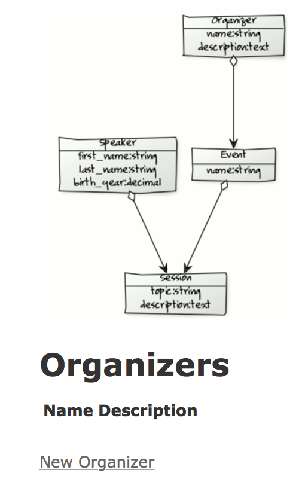
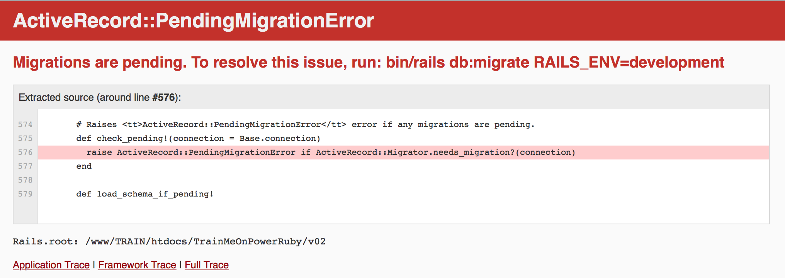

# Training Material for PowerRuby Community Edition v2

This is a Rails application refined for execution inside IBM i 7.2 or higher.
In order to be runnable on IBM i the **PowerRuby Community Edition v2** will be required.
The save files to be installed are directly available in this GitHub project under the **release** tagged as **V2R0M0**.

If you have a cURL command installed inside PASE (e.g. in a previous version of PowerRuby CE) and a direct connection to Internet from your IBM i you have the possibility to automate installation running the following PASE script (provide link here).

Otherwise please adopt the conventional approach of downloading the save files required (*pruby_base*, *pruby_0001*, and *pruby_0006*) in a personal computer and then binary-transfer them in pre-existing, empty, savefiles on your IBM i system.

This application emphasizes the features we introduced to facilitate integration of **Rails v5.1** with IBM i DB2.

Follow this README.md document as the official *PowerRuby CE2 Installation Guide*.

## Installing 1PRUBY1 V2R0M0

The goal of this paragraph is to instruct you on how to install PowerRuby Community Edition v2 on your IBM i server. 

First of all, as soon as part of the executables were optimized PASE programs and shared libraries, you need to verify that your IBM i operating system is installed on **Power7** or higher hardware.

Then you have to verify that the version of your IBM i operating system is **7.2** or higher. 

If these pre-requisites are satisfied you will enjoy PowerRuby integration in your system.

### Already installed?

First of all, let us check if 1PRUBY1 product program is already installed on your system. PowerRuby Community Edition is distributed inside different program **options**. 

To be able to run the Rails application provided in this GitHub project (**DE\_train\_01**) you are required to install at least three options of PowerRuby: **\*BASE**, **option 1** and **option 6**.

The net result using **WRKSFWRSC** will be the following:

| Resource ID | Option | Feature | Description                                    | 
| ----------- |:------ |:-------:|:---------------------------------------------- |   
|   1PRUBY1   |  *BASE |   5001  |  IBM i PowerRuby (administration utilities)    | 
|   1PRUBY1   |  *BASE |   2924  |  IBM i PowerRuby (administration utilities)    |
|   1PRUBY1   |  1     |   5002  |  IBM i PowerRuby Developer Edition (irubydb)   |
|   1PRUBY1   |  6     |   5001  |  IBM i PowerRuby (Ruby 2.4 + Rails 5.1)        |

| Resource ID | Option | Feature | Type  |  Library   | Release |
| ----------- |:------ |:-------:|:----- |:---------- |:------- |
|   1PRUBY1   |  *BASE |   5001  | *CODE | POWER_RUBY | V2R0M0  |
|   1PRUBY1   |  *BASE |   2924  | *LNG  | POWER_RUBY | V2R0M0  |
|   1PRUBY1   |  1     |   5002  | *CODE | POWER_RUBY | V2R0M0  |
|   1PRUBY1   |  6     |   5001  | *CODE | POWER_RUBY | V2R0M0  |

Please note that on a system with a primary language that differs from **2924** the language component of option 5001 will get installed in a library named **POWER_SLNG** (you may be interested in using `ADDLIBLE LIB(POWER_SLNG)`).

| Resource ID | Option | Feature | Type  |  Library   | Release |
| ----------- |:------ |:-------:|:----- |:---------- |:------- |
|   1PRUBY1   |  *BASE |   5001  | *CODE | POWER_RUBY | V2R0M0  |
|   1PRUBY1   |  *BASE |   2924  | *LNG  | POWER_SLNG | V2R0M0  |
|   1PRUBY1   |  1     |   5002  | *CODE | POWER_RUBY | V2R0M0  |
|   1PRUBY1   |  6     |   5001  | *CODE | POWER_RUBY | V2R0M0  |

### What if V1R0M0 is already installed rather than V2R0M0?

If product 1PRUBY1 **V1R0M0** is installed (*PowerRuby Community Edition v1*) and you just "played" with Ruby or (Ruby on) Rails **without** creating Rails projects you desire to keep runnable as is, you can proceed by uninstalling 1PRUBY1.

`DLTLICPGM LICPGM(1PRUBY1) 
          OPTION(*ALL)    
          RLS(V1R0M0)`
          
If you developed useful Rails application that are in use on your system, start evaluating migrating your projects to Rails 5.1 and install PowerRuby Community Edition v2 (i.e. 1PRUBY1 V2R0M0) on a different server for this task.

### What if PowerRuby is not installed? 

... or you just performed a successful DLTLICPGM on it.

Use the following commands where **\<a_lib\>** is the library where you created the savefiles for PowerRuby CE V2R0M0:

`RSTLICPGM LICPGM(1PRUBY1) DEV(*SAVF) LNG(2924)           SAVF(<a_lib>/PRUBY_BASE)`

`RSTLICPGM LICPGM(1PRUBY1) DEV(*SAVF) LNG(2924) OPTION(1) SAVF(<a_lib>/PRUBY_0001)`

`RSTLICPGM LICPGM(1PRUBY1) DEV(*SAVF) LNG(2924) OPTION(6) SAVF(<a_lib>/PRUBY_0006)`
 
## Installing the training project

### Checking for Ruby and (Ruby on) Rails versions 

When you install LICPGM(1PRUBY1) at version 2 the **POWER_RUBY** library is created in the native file system. This is where commands like RAILSNEW are located.
The installation procedure also creates an Integrated File System directory named **PowerRuby**. As soon as this directory gets created just under the root (**/**) of the IFS, the objects inside it will be fully referenced with names like the following one:

`/PowerRuby/prV2R4/bin/ruby`

If you use **QSH** you will notice that executing the simplest request to the Ruby interpreter to query the version we just installed (option \-v) a special warning will be emitted:

```terminal
  $                                                                                                      
> /PowerRuby/prV2R4/bin/ruby -v                                                                          
  <main>: warning: pthread_create failed for timer: Resource temporarily unavailable, scheduling broken  
  ruby 2.4.4p296 (2018-03-28 revision 63013) [powerpc-aix7.1]                                            
  $                                                                                                      
```

This occurs because the Ruby interpreter is a multi-threaded (PASE) program. In order to have full support for multi-threading with QShell remember to add (or change) the **QIBM\_MULTI\_THREADED** environment variable: 

`ADDENVVAR ENVVAR(QIBM_MULTI_THREADED) VALUE(Y)`

This way the internal Ruby interpreter scheduler will be supported:

```terminal
  $                                                                                                      
> /PowerRuby/prV2R4/bin/ruby -v                                                                          
  ruby 2.4.4p296 (2018-03-28 revision 63013) [powerpc-aix7.1]                                            
  $                                                                                                      
```

Similarly to Ruby, we are ready to check the version of Rails that has been installed:

```terminal
  $                                                                                                      
> /PowerRuby/prV2R4/bin/rails -v                                                                          
  5.1.6
  $                                                                                                      
```

Note: Rails command has a different behavior when the current directory is an actual Rails application. The  **Gemfile** and **Gemfile.lock** are being read in advance: accordingly, even the simplest of the requests \-as checking for the version installed\- may fail if you are inside a Rails application (e.g. an application developed with a version of Rails provided by PowerRuby Community Edition v1).  

### Using the native commands from POWER_RUBY library

One of the objectives of PowerRuby project from its inception was to simplify the use of Rails for users with an IBM i background. Things are changing so that the use of PASE shells is better known nowadays. Nonetheless we enriched **RAILSNEW** command with features that you may find useful.

One of the things we introduced in version 2 is training material for Rails applications' development that abstracts from the differences in the final tables being created on your sistem because of the differences in CCSIDs used in different countries. 
We did not considered clever enough to take the opposite direction and forcing all the text fields to be encoded in one of the alternative UTF\-\* formats.

All this was made possible by the introduction of a specialization in the **irubydb** Rails adapter we developed for IBM i DB2.
We added a extra field attribute (**ccsid**) in the so-called Rails "**migrations**" (migrations can be considered as file DDS that are interpreted rather than compiled).

The fundamental command:

`rails db:migrate`

will execute all the changes been developed but still not applied.

By reading one of the migration files for this simple application you will find a simple script like the following one:

```ruby
class CreateOrganizers < ActiveRecord::Migration[5.1]
  def change
    create_table :organizers do |t|
      t.string :name
      t.text :description, ccsid: 1208

      t.timestamps
    end
  end
end
```

By specifying **ccsid: 1208** we are instructing Rails to create a table that will have an UTF-8 encoding for the field named DESCRIPTION. While the encoding for DESCRIPTION field has been assigned, the CCSID for the field NAME will depend on your system settings.

This way on a UK-based IBM i we will have the following section when executing the DSPFFD over the generated file: 

```
NAME       CHAR           80      82         5        Both     NAME           
  Variable length field -- Allocated length :  None                           
  Allows the null value                                                       
  Coded Character Set Identifier  . . . . . :     37                          
DESCR00001 CLOB      1048576      42        87        Both     DESCRIPTION    
  Alternative name  . . . . . . . . . . . . :                                 
      DESCRIPTION                                                             
  Allocated Length  . . . . . . . . . . . . :      0                          
  Allows the null value                                                       
  Coded Character Set Identifier  . . . . . :   1208                          
  UCS2 or Unicode conversion  . . . . . . . :  *CONVERT                       
  Normalize data  . . . . . . . . . . . . . :  No                              
```  

On a system based in Italy we will read:

```  
NAME       CHAR           80      82         5        Entrambi NAME            
  Campo lungh. variabile - Lunghezza assegn. : Nessuna                         
  Consente il valore nullo                                                     
  Identificativo serie caratteri  codificati:    280                           
DESCR00001 CLOB      1048576      42        87        Entrambi DESCRIPTION     
  Nome alternativo  . . . . . . . . . . . . :                                  
      DESCRIPTION                                                              
  Lunghezza assegnata . . . . . . . . . . . :      0                           
  Consente il valore nullo                                                     
  Identificativo serie caratteri  codificati:   1208                           
  Conversione UCS2 o Unicode . . . . . . :     *CONVERT                        
  Normalizzazione dati . . . . . . . . . . . : No     
```  

The NAME CCSID will be 37 on a system and 280 on the other. 
Presumably this could simplify integration with pre-exixsting applications while leveraging the opportunities the support for Unicode by Rails (and Ruby) can offer (from the browser to the database).

A lot of explanation with very little actions... what is actually needed to install the **DE_train_01** demo&training application? 

One simple command:

```
                    Simplify usage of Rails new (RAILSNEW)             
                                                                       
Immettere le scelte e premere Invio.                                   
                                                                       
New Rails Application Name . . . > TrainMeOnPowerRuby                  
Apache HTTP Instance . . . . . . > TRAIN         Character value       
Apache Instance Port . . . . . . > 14141         Number                
Ruby Web Server Port . . . . . . > 41414         Number                
Creation mode  . . . . . . . . . > *GITHUB       *NEW, *NONE, *GITHUB  
GitHub: username . . . . . . . .                                       
GitHub: password . . . . . . . .                                       
GitHub: PowerRuby: project . . .   'DE_train_01'                       
```
   
Once completed you will have the possibility to access the application from a browser.
Let us suppose x.x.x.x is the IP address of your IBM i system. 
Now open a browser on the following URL:

`http://x.x.x.x:14141/`
    
You will see this welcoming message:




During the RAILSNEW execution the `rails db:migrate` has been submitted over the Rails application directory. This means that four application files will be created on your system ready to be managed (**CRUD** = Create\-Read\-Update\-Delete).

## Playing with the training project

The **DE\_train\_01** Rails application is simply a scaffold to test the IBM i DB2 integration provided with PowerRuby CE2. The focus of the project is on 

* supporting **CCSID at the field level** (concept we already introduced in the previous paragraph) and
* leveraging IBM i DB2 **foreign keys support** in integration with Rails ActiveRecord abstraction.

The project is a demonstration of the value of the *Convention over Configuration* principle (**CoC**) that has been key in Rails evolution. It is a demonstration of how, starting from a sketchy Entity-Relationship diagram, you can easily and pretty soon interact with a live -although skeleton- GUI interface to the data schema you are designing.

Here is the initial sketch for our application:



The E-R diagram is plainly translated into Rails Active Record migrations 
(automatically generated through `rails generate` commands). Then we add few changes in the migration and model files to reinforce the relationship among tables we would like to implement.

By running `POWER_RUBY/RAILSNEW` with the `CRT(*GITHUB)` creation mode option you are directly installing the DE\_train\_01 application on your system. Under the covers RAILSNEW performs a `git clone` operation towards [our GitHub space](https://GitHub.com/PowerRuby). 

By adding a pluralized name of one of classes created in this project we will be able to interact with the scaffold application we want to develop:

`http://x.x.x.x:14141/organizers`

This is what we get:



The layout of the project uses the image of our schema and a map provides the ability to select a different table scaffold by clicking on the different rectangles in the E-R diagram.

We can enter records in each of the tables provided we respect the referential integrity imposed in our migration files.

As soon as the **Session** class was defined in this way:

```ruby
class CreateSessions < ActiveRecord::Migration[5.1]
  def change
    create_table :sessions do |t|
      t.string :topic
      t.text :description, ccsid: 1208
      t.references :event, foreign_key: true
      t.references :speaker, foreign_key: {on_delete: :cascade}

      t.timestamps
    end
  end
end
```

the act of deleting an entry from the SPEAKERS file will delete all the SESSIONS records that were referencing that Speaker. On the contrary, the act of deleting an entry from EVENTS file will generate a DB2 error if the Event has one or more Sessions referencing it.

Developing a Rails application also means managing programmatically the legitimate use cases without leaving errors unhandled. Supporting a Rails application with an IBM i DB2 database manager sounds to be a good choice when looking for reliability and scalability.

### Where is database.yml located?

We were able to create entries in the four tabels of this simple project: ORGANIZERS, SPEAKERS, EVENTS and SESSIONS. Were are our data?

There is just one file controlling the persistency of data generated by your Rails application: **database.yml**. But we need to explain where to find it inside the IFS. 

You will remeber that we installed DE\_train\_01 application providing a number of parameters:

```
                    Simplify usage of Rails new (RAILSNEW)             
                                                                       
Immettere le scelte e premere Invio.                                   
                                                                       
New Rails Application Name . . . > TrainMeOnPowerRuby                  
Apache HTTP Instance . . . . . . > TRAIN         Character value       
Apache Instance Port . . . . . . > 14141         Number                
Ruby Web Server Port . . . . . . > 41414         Number                
Creation mode  . . . . . . . . . > *GITHUB       *NEW, *NONE, *GITHUB  
GitHub: username . . . . . . . .                                       
GitHub: password . . . . . . . .                                       
GitHub: PowerRuby: project . . .   'DE_train_01'                       
```

If you retrieve the command (**F9**) and press **F4** and **F14** on it 

```
POWER_RUBY/RAILSNEW RAILSAPP(TrainMeOnPowerRuby) 
                    HTTPSRV(TRAIN)              
                    EXTPORT(14141)               
                    INTPORT(41414)               
                    CRT(*GITHUB)                 
```                    

you will see that we were providing (among other parameters):
 
* the name for the Rails application `RAILSAPP(TrainMeOnPowerRuby)` and
* the name of an Apache HTTP instance `HTTPSRV(TRAIN)`

With the default usage of the RAILSNEW command in Community Edition v1 the Rails project would have been created in the following IFS path:

`/www/< RAILSSRV >/htdocs/< RAILSAPP >/`

But if we try to open the following file we would fail:

`/www/TRAIN/htdocs/TrainMeOnPowerRuby/config/database.yml`

With PowerRuby CE2  **and** the `CRT(*GITHUB)` mode of RAILSNEW the process is subtly different. We save the application at multiple stages in its development and keep **each** of this meaningful intermediate snapshots inside the project.

We are expecting each of the training projects to provide a **current** named symbolic link to the stable and most advanced snapshot of the project.

So that performing `ls -la /www/TRAIN/htdocs/TrainMeOnPowerRuby/` we will identify (among others) the following files:

```
lrwxrwxrwx    1 andrear  0                 6 Oct 15 21:36 current -> v02
drwxrwsrwx   12 andrear  0             24576 Oct 15 21:36 v01
drwxrwsrwx   12 andrear  0             24576 Oct 15 21:36 v02
```

This to explain that the *database.yml* file of a PowerRuby training project is located here:

`/www/TRAIN/htdocs/TrainMeOnPowerRuby/current/config/database.yml`

Let us have a look at it:

```yaml
# PowerRuby Ltd
#
#   http://powerruby.com/
#
default: &default
  adapter: irubydb
  database: '*LOCAL'
  username: '*CURRENT'
  password: ''
  default_schema: 'POWER_DATA'
  journalling:
    :jrn:          'PRUBYJRN'
  connect_options:
    :SQL_ATTR_COMMIT:      SQL_TXN_READ_COMMITTED
    :SQL_ATTR_AUTOCOMMIT:  SQL_FALSE
  env_options:                     
    :SQL_ATTR_SERVER_MODE: SQL_TRUE
    
development:
  <<: *default

test:
  <<: *default

production:
  <<: *default
```

From the `default_schema: 'POWER_DATA'` setting we easily identify that **POWER\_DATA** is the library where the application files gets created. 
But when POWER\_DATA library was created?

### POWER_DATA

When we explained the installation of PowerRuby we mentioned POWER\_RUBY and, depending on primary language of your system, POWER\_SLNG. 
During the installation of Option 1 another library gets created and this library is **POWER\_DATA**.

Just after a brand new installation it is not empty. 
Inside you find a journal, a journal receiver and two SQL user defined types (BIT and BSON): these resources are used by **irubydb** DB2 Rails Adapter.

That's why we are setting POWER\_DATA as the default_schema when initializing database.yml: the library will already be available. Obviously as soon as you create your own project you will have to modify the database.yml file specifying a valid library name as the default schema. 

Note that you can access the full set of options in file journaling (see **STRJRNPF** command help):

```yaml
  journalling:                         
    :jrn:          'PRUBYJRN'          
#   :jrn_lib:     < if omitted is searched in default_schema >        
#   :images:       '*BOTH'             
#   :omtjrne:      '*NONE'             
#   :loglvl:       '*ERRORS'           ```
```

so that you can use a pre-existing journal from a different library: 

```yaml
  journalling:                         
    :jrn:          'ERP_JRN'   
    :jrn_lib:      'ERP_LIB'
```
    
### Moving the project to another library

Let us suppose you want to free POWER\_DATA from hosting your project tables. 
You can create a brand new data library. We will also create a Journal Receiver and a Journal inside it.

```
> CRTLIB LIB(MYDATA_LIB)                                        
  Library MYDATA_LIB created.                                   
> CRTJRNRCV JRNRCV(MYDATA_LIB/MY_JRNRCV)                        
  Journal receiver MY_JRNRCV created in library MYDATA_LIB.     
> CRTJRN JRN(MYDATA_LIB/MY_JRN) JRNRCV(MYDATA_LIB/MY_JRNRCV)    
  Journal MY_JRN created in library MYDATA_LIB.                 
```

All we need to do now is to adapt our **database.yml** file


```yaml
# PowerRuby Ltd
#
#   http://powerruby.com/
#
default: &default
  adapter: irubydb
  database: '*LOCAL'
  username: '*CURRENT'
  password: ''
  default_schema: 'MYDATA_LIB'
  journalling:
    :jrn:          'MY_JRN'
  connect_options:
    :SQL_TXN_COMMIT:       SQL_TXN_READ_COMMITTED
    :SQL_ATTR_AUTOCOMMIT:  SQL_FALSE
  env_options:                     
    :SQL_ATTR_SERVER_MODE: SQL_TRUE
    
development:
  <<: *default

test:
  <<: *default

production:
  <<: *default
```

We now need to stop&start our Rails server. 

The **Apache**-side is filtered with `WRKACTJOB JOB(TRAIN)`   

```
Type options, press Enter.                                               
  2=Change   3=Hold   4=End   5=Work with   6=Release   7=Display message
  8=Work with spooled files   13=Disconnect ...                          
                    Current                                              
Opt  Subsystem/Job  User        Type  CPU %  Function        Status      
       TRAIN        QTMHHTTP    BCH      .0  PGM-QZHBMAIN     SIGW       
       TRAIN        QTMHHTTP    BCI      .0  PGM-QZSRLOG      SIGW       
       TRAIN        QTMHHTTP    BCI      .0  PGM-QZSRHTTP     SIGW       
       TRAIN        QTMHHTTP    BCI      .0  PGM-QZSRHTTP     DEQW       
```                                                                               

The job executing **PGM-QZHBMAIN** is the one that was directly sumbitted.
The Apache configuration file is `/www/TRAIN/conf/httpd.conf`. 
We stop this activities with `ENDTCPSVR SERVER(*HTTP) HTTPSVR(TRAIN)` and restart them with 
`STRTCPSVR SERVER(*HTTP) HTTPSVR(TRAIN)`. 
 

With the `WRKACTJOB JOB(RAILS*)` you can easily identify the Rails servers:

```
                     Current                                                   
 Opt  Subsystem/Job  User        Type  CPU %  Function        Status           
        RAILSSRV     ANDREAR     BCH      .0  PGM-ruby         THDW            
```

This is the **PASE**-side of our web serving. 
Using *option 5* and then *option 20* you can veify the multi-threaded nature of Rails.

If we look at the joblog we will find a note:

```
To terminate:                                                      
POWER_RUBY/RAILSSVR ACTION(*END)                                   
  APP('/www/TRAIN/htdocs/TrainMeOnPowerRuby/current') PID('server')
```

This means that we can stop and restart the PASE server with the following commands:

`POWER_RUBY/RAILSSVR ACTION(*END) APP('/www/TRAIN/htdocs/TrainMeOnPowerRuby/current')`

```
POWER_RUBY/RAILSSVR ACTION(*START)                          
                    APP('/www/TRAIN/htdocs/TrainMeOnPowerRuby/current')                         
                    VRM(*V24)                               
                    PORT(41414)                             
```


But once we reconnect with our browser we receive this error message:



First of all we should appreciate the level of integration: the Rails framework is helping us in the diagnosis of what may be wrong! If we look at our library (now MYDATA\_LIB) the only objects existing are still the journal and the receiver.

```
                         Work with Objects Using PDM                  
                                                                               
Library . . . . .   MYDATA_LIB       Position to . . . . . . . .               
                                     Position to type  . . . . .               
                                                                               
Type options, press Enter.                                                     
  2=Change       3=Copy        4=Delete      5=Display       7=Rename          
  8=Display description        9=Save       10=Restore      11=Move ...        
                                                                               
Opt  Object      Type        Attribute   Text                                  
     MY_JRNRCV   *JRNRCV                                                       
     MY_JRN      *JRN                                                          
                                                                               
```

To solve we need to execute the `rails db:migrate` inside the project folder.
Let us try to automate this task with our own new CL source. 

We will create a CLP from the following CL source:

```
*************** Beginning of data ***************************************************
             PGM                                                                     
             CHDIR      DIR('/www/TRAIN/htdocs/TrainMeOnPowerRuby/current')          
             CHGENVVAR  ENVVAR(QIBM_MULTI_THREADED) VALUE(Y)                         
             MONMSG     MSGID(CPFA981) EXEC(ADDENVVAR +                              
                          ENVVAR(QIBM_MULTI_THREADED) VALUE(Y))                      
             QSH        CMD('/PowerRuby/prV2R4/bin/rails db:migrate')                
             ENDPGM                                                                  
****************** End of data ******************************************************
```

Once compiled we can sumbit it in batch mode. This is the spool file we get:

```
                                        Display Spooled File                                                       
File  . . . . . :   QPRINT                                                                     
Control . . . . .                                                                       
Find  . . . . . .                                                                                                                 
*...+....1....+....2....+....3....+....4....+....5....+....6....+....7....+....8....+....9....+....0....+....1....+....2....+....3
/PowerRuby/prV2R4/lib/ruby/gems/2.4.0/gems/railties-5.1.6/lib/rails/app_loader.rb:40: warning: Insecure world writable dir /www/TR
== 20181008141216 CreateOrganizers: migrating =================================                                                   
-- create_table(:organizers)                                                                                                      
   -> 0.1537s                                                                                                                     
== 20181008141216 CreateOrganizers: migrated (0.1539s) ========================                                                   
== 20181008141221 CreateEvents: migrating =====================================                                                   
-- create_table(:events)                                                                                                          
   -> 0.5182s                                                                                                                     
== 20181008141221 CreateEvents: migrated (0.5184s) ============================                                                   
== 20181008141226 CreateSpeakers: migrating ===================================                                                   
-- create_table(:speakers)                                                                                                        
   -> 0.1171s                                                                                                                     
== 20181008141226 CreateSpeakers: migrated (0.1174s) ==========================                                                   
== 20181008141231 CreateSessions: migrating ===================================                                                   
-- create_table(:sessions)                                                                                                        
   -> 0.3620s                                                                                                                     
== 20181008141231 CreateSessions: migrated (0.3622s) ==========================                                                   
```

The Rails app_loader performs a subtle check on the directories making up the environemnt PATH variable.
If any of directories searched for execution is **world writable** (i.e. public write rights granted) a warning is emitted.
You have to fix this before going into production mode.

Note that there is no need to stop&start the Rails server because, in development mode, it will be capable of taking into consideration a good number of changes in the code ( changes in database.yml are one of these exceptions and require such a restart ).

If we look at our library filtering for files we will find a number of changes!

```
                          Work with Objects Using PDM          
                                                               
 Library . . . . .   MYDATA_LIB       Position to . . . . . . .
                                      Position to type  . . . .
                                                               
 Type options, press Enter.                                    
   2=Change       3=Copy        4=Delete      5=Display       7
   8=Display description        9=Save       10=Restore      11
                                                               
 Opt  Object      Type        Attribute   Text                 
      AR_IN00001  *FILE       PF-DTA                           
      EVENTS      *FILE       PF-DTA                           
      INDEX00001  *FILE       LF                               
      INDEX00002  *FILE       LF                               
      INDEX00003  *FILE       LF                               
      ORGANIZERS  *FILE       PF-DTA                           
      SCHEM00001  *FILE       PF-DTA                           
      SESSIONS    *FILE       PF-DTA                           
      SPEAKERS    *FILE       PF-DTA 
```

Start developing your new applications with Rails and IBM i DB2 by means of **PowerRuby Community Edition v2**!
